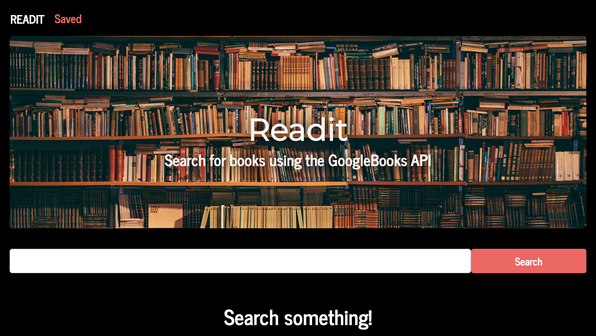
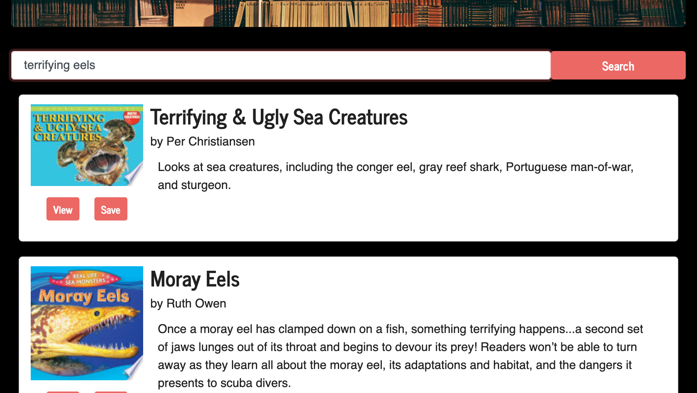
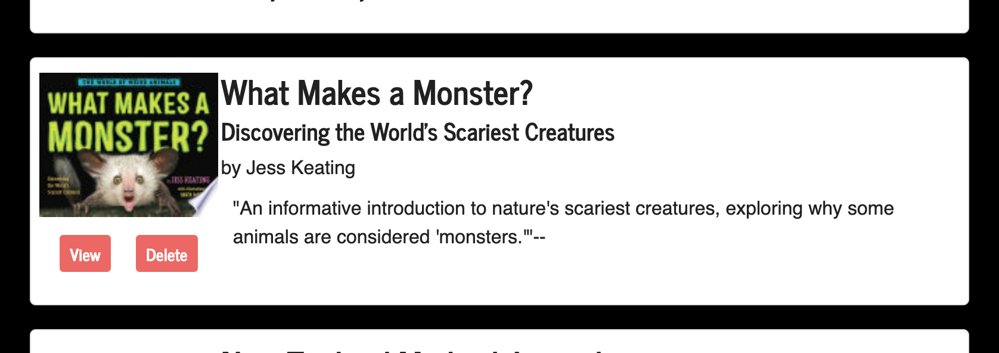
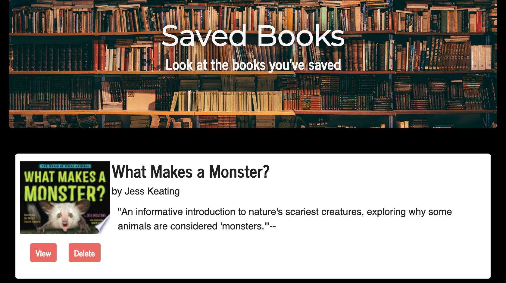

# Readit

Search for books using the Google Books API, and save them to your library for reading!

## Tech Stack
* HTTP Server: ExpressJS
* Data Layer: MongoDB/Mongoose
* Frontend: React

Enter a search term, and see what books you can find.

If you see one you like, click 'save' to save it for later.

Click on the 'Saved' tab in the navbar to look at all the saved books.

### Made completely by Noah Sylwester